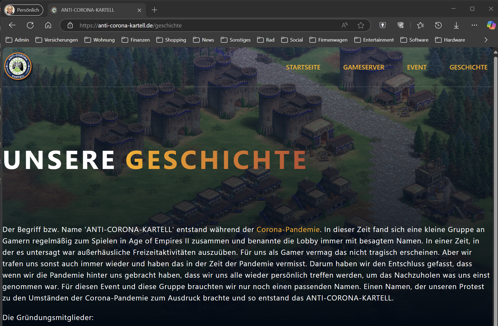

# Top! Genial! Das Endergebnis begeistert mich! :-)

Etwas Finetuning habe ich noch betrieben und kleine Änderungen eingepflegt. Die Seite geht so erst mal online.

**Neuen ´Bug' gefunden:**
Die Seiten Gameserver, Event, Geschichte, Datenschutzerklärung und Impressum haben auf kleineren Displays (Tablet) das Problem, dass der Text links  direkt an der Seitengrenze anliegt. Da sollte auch noch ein Abstand rein. Beispiel Anhand 'Unserer Geschichte':

**Abgsehen davon hätte ich noch zwei Wünsche:**

In der Fusszeile hätte ich gerne noch einen Link auf meinen Namen - zu meiner persönlichen Homepage.
Nur hier nicht farblich dargestellt. Es soll unauffällig sein und nur der Mauscursor soll sich beim Hoovern ändern.

Zudem fände ich es schöner, wenn auf mobilen Geräten (aka iPhone) in der Fusszeile Copyright-Information und Text dann
übereinander stünden. Also "Alle Rechte vorbehalten." unter "©2025 Claus Schiroky." steht.

Kannst du mir diese Gefallen noch tun?

Gerne können wir uns die Tage auch noch mal via Teams treffen. Ich möchte dir auf alle Fälle auch noch persönlich Feedback geben.